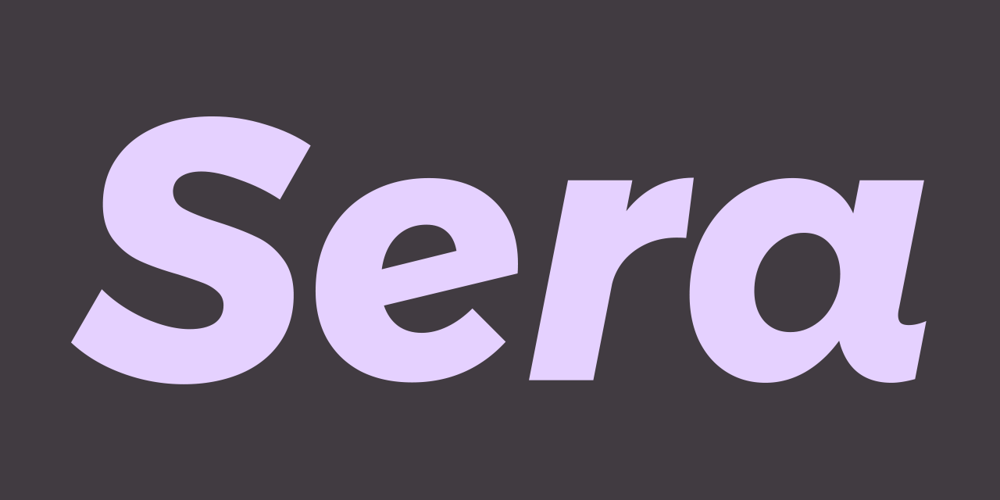

# :wave::smile: Welcome to the GoofyTeam profile

## :thinking: Who are we?

GoofyTeam is a group of students from [HETIC](https://www.hetic.net/), a french graduate school specializing in tech and digital professions.
In this organization, there is the core of the goofyteam and some of our peers who have joined us for various projects.

### The core of the GoofyTeam

- Albuquerque Adrien - [**@ADR1811**](https://github.com/ADR1811)
- Azevedo Da Silva Antoine - [**@DestroyCom**](https://github.com/DestroyCom)
- Buisson Thomas - [**@ThomAzgo**](https://github.com/ThomAzgo)
- Grousset Luca - [**@lucag322**](https://github.com/lucag322)
- Vo Brandon - [**@Hiteazel**](https://github.com/Hiteazel)

### Our peers

- Jounaedi - [**@Jounaedi**](https://github.com/Jounaedi)
- Maedeh Vasheghani - [**@Maedeh-vasheghani**](https://github.com/Maedeh-vasheghani)
- n4thans - [**@n4thans**](https://github.com/n4thans)

---

## :trophy: Our Most Favorite Projects

Our favorite project, and the one we think is the most complete, is :

GoofySera

### What is GoofySera ?

SeRA for Saline _**Experience**_ Royal academy, is a DAM (Digital Asset Management).
This web application is designed to improve the production methods of the Saline Royale's online courses.
Realized for our final project of our diploma at Hetic.
This project brings together all the skills learned during our work-study placements and our last 3 years.
Powered by React and Laravel under our own network architecture.
We had to imagine this app from A to Z, designing our own CIs, our own codebase, etc...

---

## :rocket: Some of our other projects

### GoofyComponent

- [GoofyComponent](https://github.com/GoofyComponent/GoofyComponent) - A component library written in Svelte
- [GoofyChat](https://github.com/GoofyComponent/GoofyChat) & [GoofyMessenger](https://github.com/GoofyComponent/GoofyMessenger) - Web chat application (like whatsapp) with a backend in symfony and a frontend in React
